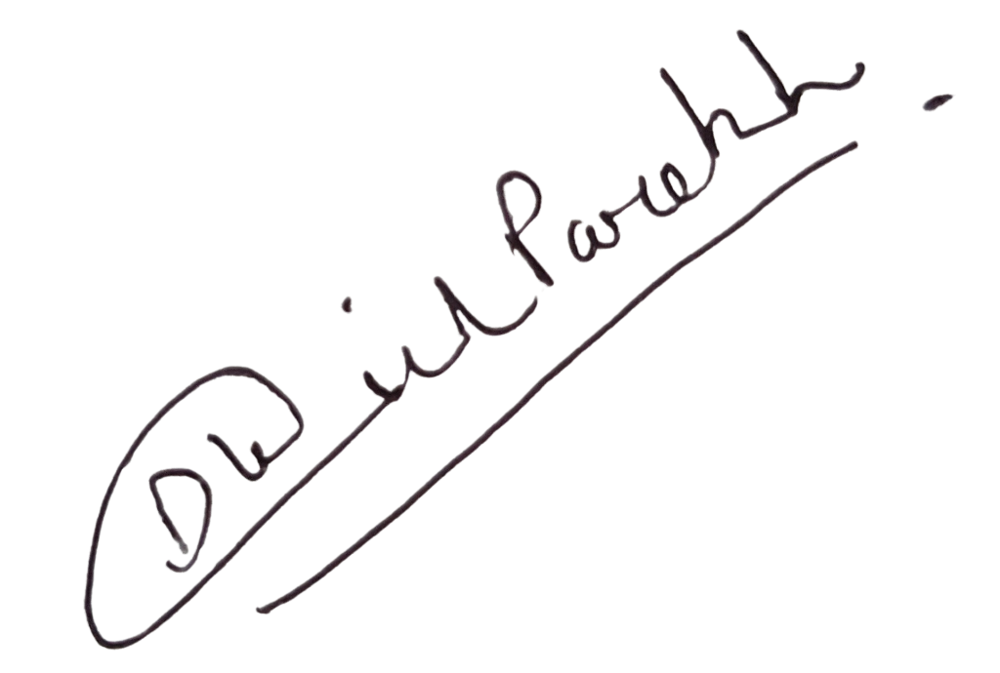
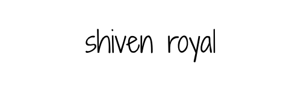
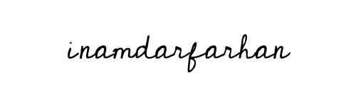

---
pdf_options:
  format: a4
  margin: 25mm
css: |
  body {
    font-family: 'Times New Roman', Times, serif;
    font-size: 14pt;
    line-height: 1.6;
  }
  .center {
    text-align: center;
    font-weight: bold;
    text-decoration: underline;
    font-size: 16pt;
    margin-bottom: 2rem;
  }
  .signature-block {
    margin-top: 3rem;
    display: flex;
    justify-content: space-between;
  }
  .signee {
    width: 45%;
    margin-bottom: 2rem;
  }
---

DECLARATION AND NO OBJECTION CERTIFICATE

**Date:** 6 April 2026

**To,**  
The Registrar of Copyrights,  
Copyright Office

**Subject:** Declaration of Joint Ownership and No Objection Certificate for Software titled **"LinnkedOut"**

Dear Sir/Madam,

I, **Dhrish Parekh**, the primary applicant for this registration, am writing to formally state and declare the following regarding the software titled **"LinnkedOut"**:

1. That the aforementioned Software was jointly conceptualized, designed, and developed by myself, **Shiven Royal**, and **Farhan Inamdar**. 

2. That all three of us are equal co-owners and co-authors of this Software.

3. That my co-authors, Shiven Royal and Farhan Inamdar, have mutually agreed and have no objection to my submitting this application on our collective behalf.

4. That the copyright for the said Software shall be registered jointly in the names of all three co-owners, namely:
   **1. Dhrish Parekh**
   **2. Shiven Royal**
   **3. Farhan Inamdar**

Below are the signatures of my co-authors, confirming their agreement with this arrangement, and stating that they have given their No Objection without any pressure, coercion, or undue influence.

  

Yours faithfully,

  

     
    <strong>Signature</strong> 
    <strong>Applicant:</strong> Dhrish Parekh 
    <strong>Date:</strong> 6 April 2026 
  

  

     
    <strong>Signature</strong> 
    <strong>Co-Author:</strong> Shiven Royal 
    <strong>Date:</strong> 6 April 2026 
  

  

     
    <strong>Signature</strong> 
    <strong>Co-Author:</strong> Farhan Inamdar 
    <strong>Date:</strong> 6 April 2026 
  

